Process perspective
===================


```python
# Listing 8 Reading and printing an event log with a dictionary

import datetime

f = open('purchasing.csv', 'r')

log = dict()

for line in f:
    line = line.strip()
    if len(line) == 0:
        continue
    parts = line.split(',')
    caseid = parts[0]
    task = parts[3]
    user = parts[4]
    timestamp = datetime.datetime.strptime(parts[1], '%Y-%m-%d %H:%M:%S')
    if caseid not in log:
        log[caseid] = []
    event = (task, user, timestamp)
    log[caseid].append(event)
    
f.close()

#for caseid in sorted(log.keys()):
#    log[caseid].sort(key = lambda event: event[-1])
#    for (task, user, timestamp) in log[caseid]:
#        print(caseid, task, user, timestamp)
```


```python
# Listing 11 Implementing the control-flow algorithm in Python

F = dict()
for caseid in log:
    for i in range(0, len(log[caseid])-1):
        ai = log[caseid][i][0]
        aj = log[caseid][i+1][0] 
        if ai not in F:
            F[ai] = dict()
        if aj not in F[ai]:
            F[ai][aj] = 0
        F[ai][aj] += 1

for ai in sorted(F.keys()):
    for aj in sorted(F[ai].keys()):
        print(ai, '->', aj, ':', F[ai][aj])

```

    Amend Purchase Requisition -> Analyze Purchase Requisition : 8
    Amend Purchase Requisition -> Create Request for Quotation Requester : 3
    Amend Request for Quotation Requester -> Analyze Request for Quotation : 514
    Amend Request for Quotation Requester Manager -> Analyze Request for Quotation : 49
    Analyze Purchase Requisition -> Amend Purchase Requisition : 11
    Analyze Purchase Requisition -> Create Request for Quotation Requester Manager : 307
    Analyze Quotation comparison Map -> Choose best option : 413
    Analyze Request for Quotation -> Amend Request for Quotation Requester : 514
    Analyze Request for Quotation -> Amend Request for Quotation Requester Manager : 49
    Analyze Request for Quotation -> Send Request for Quotation to Supplier : 413
    Approve Purchase Order for payment -> Send invoice : 413
    Authorize Supplier's Invoice payment -> Pay invoice : 413
    Choose best option -> Settle conditions with supplier : 413
    Confirm Purchase Order -> Deliver Goods Services : 413
    Create Purchase Order -> Confirm Purchase Order : 413
    Create Purchase Requisition -> Analyze Purchase Requisition : 374
    Create Purchase Requisition -> Create Request for Quotation Requester : 234
    Create Quotation comparison Map -> Analyze Quotation comparison Map : 413
    Create Request for Quotation Requester -> Analyze Request for Quotation : 237
    Create Request for Quotation Requester Manager -> Analyze Request for Quotation : 307
    Deliver Goods Services -> Release Purchase Order : 413
    Release Purchase Order -> Approve Purchase Order for payment : 413
    Release Purchase Order -> Settle dispute with supplier Purchasing Agent : 26
    Release Supplier's Invoice -> Authorize Supplier's Invoice payment : 323
    Release Supplier's Invoice -> Settle dispute with supplier Financial Manager : 80
    Send Request for Quotation to Supplier -> Create Quotation comparison Map : 413
    Send invoice -> Authorize Supplier's Invoice payment : 10
    Send invoice -> Release Supplier's Invoice : 403
    Settle conditions with supplier -> Create Purchase Order : 413
    Settle dispute with supplier Financial Manager -> Authorize Supplier's Invoice payment : 80
    Settle dispute with supplier Purchasing Agent -> Release Purchase Order : 26


```python
import graphviz as gv

G = gv.Digraph(strict=False)
G.graph_attr['rankdir'] = 'LR'
G.node_attr['shape'] = 'box'

F = dict()
for caseid in log:
    for i in range(0, len(log[caseid])-1):
        ai = log[caseid][i][0]
        aj = log[caseid][i+1][0] 
        if ai not in F:
            F[ai] = dict()
        if aj not in F[ai]:
            F[ai][aj] = 0
        F[ai][aj] += 1

A = dict()
for caseid in log:
    for i in range(0, len(log[caseid])):
        ai = log[caseid][i][0]
        if ai not in A:
            A[ai] = 0
        A[ai] += 1

x_min = min(A.values())
x_max = max(A.values())
for ai in A:
    text = ai + '\n(' + str(A[ai]) + ')'
    gray = int(float(x_max - A[ai]) / float(x_max - x_min) * 100.)
    fill = 'gray' + str(gray)
    font = 'black'
    if gray < 50:
        font = 'white'
    G.node(ai, label=text, style='filled', fillcolor=fill, fontcolor=font)

values = [F[ai][aj] for ai in F for aj in F[ai]]
x_min = min(values)
x_max = max(values)
y_min = 1.0
y_max = 5.0
for ai in F:
    for aj in F[ai]:
        x = F[ai][aj]
        y = y_min + (y_max-y_min) * float(x-x_min) / float(x_max-x_min)
        G.edge(ai, aj, label=str(x), penwidth=str(y))

G
```


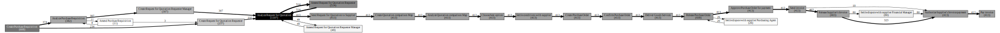


```python
# Listing 32 Calculating the average timestamp difference for each transition
D = dict()
for caseid in log:
    for i in range(0,len(log[caseid])-1):
        (ai,_,ti) = log[caseid][i]
        (aj,_,tj) = log[caseid][i+1]
        if ai not in D:
            D[ai] = dict()
        if aj not in D[ai]:
            D[ai][aj] = []
        D[ai][aj].append(tj-ti)
        
for ai in sorted(D.keys()):
    for aj in sorted(D[ai].keys()):
        sum_td = sum(D[ai][aj], datetime.timedelta(0))
        count_td = len(D[ai][aj])
        avg_td = sum_td/count_td
        avg_td -= datetime.timedelta(microseconds=avg_td.microseconds)
        D[ai][aj] = avg_td
        print(ai, '->', aj, ':', D[ai][aj])
```

    Amend Purchase Requisition -> Analyze Purchase Requisition : 18:12:30
    Amend Purchase Requisition -> Create Request for Quotation Requester : 4:52:20
    Amend Request for Quotation Requester -> Analyze Request for Quotation : 8 days, 12:35:49
    Amend Request for Quotation Requester Manager -> Analyze Request for Quotation : 10 days, 13:22:52
    Analyze Purchase Requisition -> Amend Purchase Requisition : 11:51:54
    Analyze Purchase Requisition -> Create Request for Quotation Requester Manager : 0:12:07
    Analyze Quotation comparison Map -> Choose best option : 0:20:09
    Analyze Request for Quotation -> Amend Request for Quotation Requester : 1:13:00
    Analyze Request for Quotation -> Amend Request for Quotation Requester Manager : 16:22:41
    Analyze Request for Quotation -> Send Request for Quotation to Supplier : 17:08:27
    Approve Purchase Order for payment -> Send invoice : 1 day, 22:54:06
    Authorize Supplier's Invoice payment -> Pay invoice : 0:35:10
    Choose best option -> Settle conditions with supplier : 12:03:05
    Confirm Purchase Order -> Deliver Goods Services : 2 days, 20:05:05
    Create Purchase Order -> Confirm Purchase Order : 1 day, 19:18:11
    Create Purchase Requisition -> Analyze Purchase Requisition : 17:40:23
    Create Purchase Requisition -> Create Request for Quotation Requester : 4:35:35
    Create Quotation comparison Map -> Analyze Quotation comparison Map : 10:03:21
    Create Request for Quotation Requester -> Analyze Request for Quotation : 6 days, 3:38:08
    Create Request for Quotation Requester Manager -> Analyze Request for Quotation : 4 days, 6:30:18
    Deliver Goods Services -> Release Purchase Order : 1 day, 8:54:41
    Release Purchase Order -> Approve Purchase Order for payment : 14:40:35
    Release Purchase Order -> Settle dispute with supplier Purchasing Agent : 7:49:50
    Release Supplier's Invoice -> Authorize Supplier's Invoice payment : 0:05:00
    Release Supplier's Invoice -> Settle dispute with supplier Financial Manager : 0:35:58
    Send Request for Quotation to Supplier -> Create Quotation comparison Map : 7:54:02
    Send invoice -> Authorize Supplier's Invoice payment : 14:23:54
    Send invoice -> Release Supplier's Invoice : 14:20:38
    Settle conditions with supplier -> Create Purchase Order : 19:15:07
    Settle dispute with supplier Financial Manager -> Authorize Supplier's Invoice payment : 0:24:04
    Settle dispute with supplier Purchasing Agent -> Release Purchase Order : 16:48:04


```python
# Listing 34 Drawing the graph with average timestamp differences

import graphviz as gv

G = gv.Digraph(strict=False)

G.graph_attr['rankdir'] = 'LR'
G.node_attr['shape'] = 'box'

D = dict()
for caseid in log:
    for i in range(0,len(log[caseid])-1):
        (ai,_,ti) = log[caseid][i]
        (aj,_,tj) = log[caseid][i+1]
        if ai not in D:
            D[ai] = dict()
        if aj not in D[ai]:
            D[ai][aj] = []
        D[ai][aj].append(tj-ti)

for ai in sorted(D.keys()):
    for aj in sorted(D[ai].keys()):
        sum_td = sum(D[ai][aj], datetime.timedelta(0))
        count_td = len(D[ai][aj])
        avg_td = sum_td/count_td
        avg_td -= datetime.timedelta(microseconds=avg_td.microseconds)
        D[ai][aj] = avg_td

values = [D[ai][aj].total_seconds() for ai in D for aj in D[ai]]
x_min = min(values)
x_max = max(values)

y_min = 1.0
y_max = 5.0

for ai in D:
    for aj in D[ai]:
        x = D[ai][aj].total_seconds()
        y = y_min + (y_max-y_min) * float(x-x_min) / float(x_max-x_min)
        G.edge(ai, aj, label=str(D[ai][aj]), penwidth=str(y))

G
```


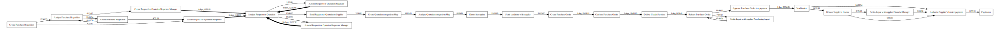


Organizational mining
=====================

> *Handover* measure


```python
# Listing 20 Implementing the handover-of-work algorithm in Python

H = dict()

for caseid in log:
    for i in range(0, len(log[caseid])-1):
        ui = log[caseid][i][1]
        uj = log[caseid][i+1][1]
        if ui not in H:
            H[ui] = dict()
        if uj not in H[ui]:
            H[ui][uj] = 0
        H[ui][uj] += 1

```


```python
# Listing 21 Generating the output graph with Graphviz

import graphviz as pg

G = gv.Digraph(strict=False)

G.graph_attr['rankdir'] = 'LR'
G.node_attr['shape'] = 'circle'

values = [H[ui][uj] for ui in H for uj in H[ui]]
x_min = min(values)
x_max = max(values)

y_min = 1.0
y_max = 5.0

for ui in H:
    for uj in H[ui]:
        x = H[ui][uj]
        y = y_min + (y_max-y_min) * float(x-x_min) / float(x_max-x_min)
        G.edge(ui, uj, label=str(x), penwidth=str(y))

G
```


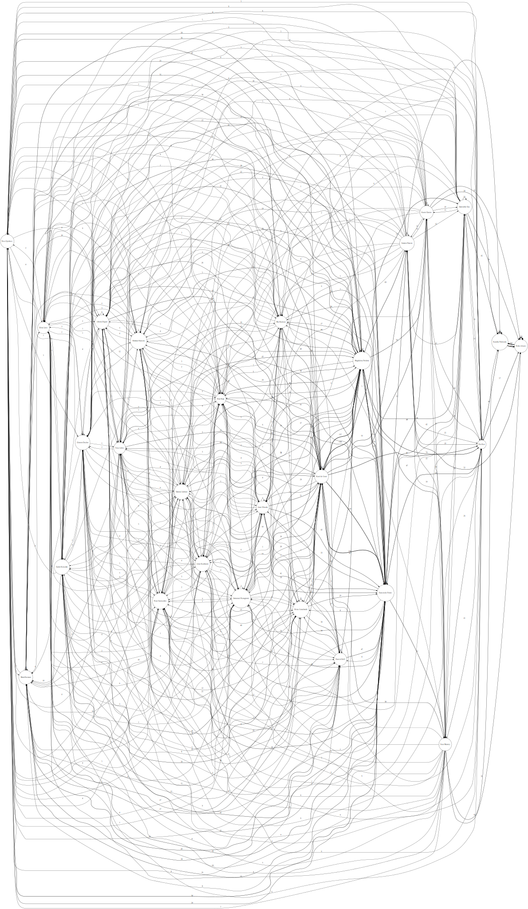


> Working together measure


```python
# Listing 22 Implementing the working together algorithm
W = dict()

for caseid in log:
    S = set()
    for i in range(0, len(log[caseid])):
        ui = log[caseid][i][1]
        S.add(ui)
    S = sorted(list(S))
    for i in range(0, len(S)-1):
        for j in range(i+1, len(S)):
            ui = S[i]
            uj = S[j]
            if ui not in W:
                W[ui] = dict()
            if uj not in W[ui]:
                W[ui][uj] = 0
            W[ui][uj] += 1

for ui in sorted(W.keys()):
    for uj in sorted(W[ui].keys()):
        print(ui, '--', uj, ':', W[ui][uj])
```

    Alberto Duport -- Anna Kaufmann : 37
    Alberto Duport -- Anne Olwada : 45
    Alberto Duport -- Carmen Finacse : 68
    Alberto Duport -- Christian Francois : 43
    Alberto Duport -- Clement Duchot : 47
    Alberto Duport -- Elvira Lores : 38
    Alberto Duport -- Esmana Liubiata : 35
    Alberto Duport -- Esmeralda Clay : 65
    Alberto Duport -- Fjodor Kowalski : 42
    Alberto Duport -- Francis Odell : 60
    Alberto Duport -- Francois de Perrier : 130
    Alberto Duport -- Heinz Gutschmidt : 55
    Alberto Duport -- Immanuel Karagianni : 46
    Alberto Duport -- Karalda Nimwada : 110
    Alberto Duport -- Karel de Groot : 136
    Alberto Duport -- Karen Clarens : 54
    Alberto Duport -- Kim Passa : 45
    Alberto Duport -- Kiu Kan : 76
    Alberto Duport -- Magdalena Predutta : 137
    Alberto Duport -- Maris Freeman : 58
    Alberto Duport -- Miu Hanwan : 43
    Alberto Duport -- Nico Ojenbeer : 53
    Alberto Duport -- Pedro Alvares : 116
    Alberto Duport -- Penn Osterwalder : 44
    Alberto Duport -- Sean Manney : 54
    Alberto Duport -- Tesca Lobes : 45
    Anna Kaufmann -- Anne Olwada : 47
    Anna Kaufmann -- Carmen Finacse : 65
    Anna Kaufmann -- Christian Francois : 39
    Anna Kaufmann -- Clement Duchot : 37
    Anna Kaufmann -- Elvira Lores : 37
    Anna Kaufmann -- Esmana Liubiata : 41
    Anna Kaufmann -- Esmeralda Clay : 48
    Anna Kaufmann -- Fjodor Kowalski : 37
    Anna Kaufmann -- Francis Odell : 43
    Anna Kaufmann -- Francois de Perrier : 126
    Anna Kaufmann -- Heinz Gutschmidt : 38
    Anna Kaufmann -- Immanuel Karagianni : 45
    Anna Kaufmann -- Karalda Nimwada : 107
    Anna Kaufmann -- Karel de Groot : 128
    Anna Kaufmann -- Karen Clarens : 45
    Anna Kaufmann -- Kim Passa : 41
    Anna Kaufmann -- Kiu Kan : 77
    Anna Kaufmann -- Magdalena Predutta : 127
    Anna Kaufmann -- Maris Freeman : 42
    Anna Kaufmann -- Miu Hanwan : 38
    Anna Kaufmann -- Nico Ojenbeer : 45
    Anna Kaufmann -- Pedro Alvares : 105
    Anna Kaufmann -- Penn Osterwalder : 28
    Anna Kaufmann -- Sean Manney : 63
    Anna Kaufmann -- Tesca Lobes : 39
    Anne Olwada -- Carmen Finacse : 67
    Anne Olwada -- Christian Francois : 49
    Anne Olwada -- Clement Duchot : 45
    Anne Olwada -- Elvira Lores : 41
    Anne Olwada -- Esmana Liubiata : 43
    Anne Olwada -- Esmeralda Clay : 61
    Anne Olwada -- Fjodor Kowalski : 45
    Anne Olwada -- Francis Odell : 58
    Anne Olwada -- Francois de Perrier : 138
    Anne Olwada -- Heinz Gutschmidt : 48
    Anne Olwada -- Immanuel Karagianni : 52
    Anne Olwada -- Karalda Nimwada : 118
    Anne Olwada -- Karel de Groot : 141
    Anne Olwada -- Karen Clarens : 53
    Anne Olwada -- Kim Passa : 47
    Anne Olwada -- Kiu Kan : 83
    Anne Olwada -- Magdalena Predutta : 144
    Anne Olwada -- Maris Freeman : 52
    Anne Olwada -- Miu Hanwan : 52
    Anne Olwada -- Nico Ojenbeer : 49
    Anne Olwada -- Pedro Alvares : 122
    Anne Olwada -- Penn Osterwalder : 44
    Anne Olwada -- Sean Manney : 65
    Anne Olwada -- Tesca Lobes : 51
    Carmen Finacse -- Christian Francois : 71
    Carmen Finacse -- Clement Duchot : 65
    Carmen Finacse -- Elvira Lores : 62
    Carmen Finacse -- Esmana Liubiata : 66
    Carmen Finacse -- Esmeralda Clay : 76
    Carmen Finacse -- Fjodor Kowalski : 77
    Carmen Finacse -- Francis Odell : 63
    Carmen Finacse -- Francois de Perrier : 187
    Carmen Finacse -- Heinz Gutschmidt : 52
    Carmen Finacse -- Immanuel Karagianni : 67
    Carmen Finacse -- Karalda Nimwada : 174
    Carmen Finacse -- Karel de Groot : 183
    Carmen Finacse -- Karen Clarens : 64
    Carmen Finacse -- Kim Passa : 69
    Carmen Finacse -- Kiu Kan : 94
    Carmen Finacse -- Magdalena Predutta : 192
    Carmen Finacse -- Maris Freeman : 66
    Carmen Finacse -- Miu Hanwan : 71
    Carmen Finacse -- Nico Ojenbeer : 76
    Carmen Finacse -- Pedro Alvares : 183
    Carmen Finacse -- Penn Osterwalder : 58
    Carmen Finacse -- Sean Manney : 80
    Carmen Finacse -- Tesca Lobes : 69
    Christian Francois -- Clement Duchot : 50
    Christian Francois -- Elvira Lores : 47
    Christian Francois -- Esmana Liubiata : 41
    Christian Francois -- Esmeralda Clay : 57
    Christian Francois -- Fjodor Kowalski : 46
    Christian Francois -- Francis Odell : 50
    Christian Francois -- Francois de Perrier : 131
    Christian Francois -- Heinz Gutschmidt : 46
    Christian Francois -- Immanuel Karagianni : 52
    Christian Francois -- Karalda Nimwada : 114
    Christian Francois -- Karel de Groot : 131
    Christian Francois -- Karen Clarens : 51
    Christian Francois -- Kim Passa : 39
    Christian Francois -- Kiu Kan : 84
    Christian Francois -- Magdalena Predutta : 143
    Christian Francois -- Maris Freeman : 60
    Christian Francois -- Miu Hanwan : 52
    Christian Francois -- Nico Ojenbeer : 43
    Christian Francois -- Pedro Alvares : 121
    Christian Francois -- Penn Osterwalder : 30
    Christian Francois -- Sean Manney : 68
    Christian Francois -- Tesca Lobes : 42
    Clement Duchot -- Elvira Lores : 38
    Clement Duchot -- Esmana Liubiata : 37
    Clement Duchot -- Esmeralda Clay : 61
    Clement Duchot -- Fjodor Kowalski : 42
    Clement Duchot -- Francis Odell : 44
    Clement Duchot -- Francois de Perrier : 132
    Clement Duchot -- Heinz Gutschmidt : 49
    Clement Duchot -- Immanuel Karagianni : 48
    Clement Duchot -- Karalda Nimwada : 117
    Clement Duchot -- Karel de Groot : 132
    Clement Duchot -- Karen Clarens : 59
    Clement Duchot -- Kim Passa : 44
    Clement Duchot -- Kiu Kan : 81
    Clement Duchot -- Magdalena Predutta : 137
    Clement Duchot -- Maris Freeman : 46
    Clement Duchot -- Miu Hanwan : 53
    Clement Duchot -- Nico Ojenbeer : 47
    Clement Duchot -- Pedro Alvares : 118
    Clement Duchot -- Penn Osterwalder : 49
    Clement Duchot -- Sean Manney : 65
    Clement Duchot -- Tesca Lobes : 36
    Elvira Lores -- Esmana Liubiata : 42
    Elvira Lores -- Esmeralda Clay : 61
    Elvira Lores -- Fjodor Kowalski : 49
    Elvira Lores -- Francis Odell : 56
    Elvira Lores -- Francois de Perrier : 130
    Elvira Lores -- Heinz Gutschmidt : 51
    Elvira Lores -- Immanuel Karagianni : 47
    Elvira Lores -- Karalda Nimwada : 121
    Elvira Lores -- Karel de Groot : 135
    Elvira Lores -- Karen Clarens : 53
    Elvira Lores -- Kim Passa : 42
    Elvira Lores -- Kiu Kan : 77
    Elvira Lores -- Magdalena Predutta : 136
    Elvira Lores -- Maris Freeman : 51
    Elvira Lores -- Miu Hanwan : 50
    Elvira Lores -- Nico Ojenbeer : 45
    Elvira Lores -- Pedro Alvares : 124
    Elvira Lores -- Penn Osterwalder : 48
    Elvira Lores -- Sean Manney : 61
    Elvira Lores -- Tesca Lobes : 44
    Esmana Liubiata -- Esmeralda Clay : 62
    Esmana Liubiata -- Fjodor Kowalski : 44
    Esmana Liubiata -- Francis Odell : 51
    Esmana Liubiata -- Francois de Perrier : 134
    Esmana Liubiata -- Heinz Gutschmidt : 44
    Esmana Liubiata -- Immanuel Karagianni : 53
    Esmana Liubiata -- Karalda Nimwada : 115
    Esmana Liubiata -- Karel de Groot : 129
    Esmana Liubiata -- Karen Clarens : 55
    Esmana Liubiata -- Kim Passa : 45
    Esmana Liubiata -- Kiu Kan : 82
    Esmana Liubiata -- Magdalena Predutta : 129
    Esmana Liubiata -- Maris Freeman : 45
    Esmana Liubiata -- Miu Hanwan : 50
    Esmana Liubiata -- Nico Ojenbeer : 50
    Esmana Liubiata -- Pedro Alvares : 120
    Esmana Liubiata -- Penn Osterwalder : 48
    Esmana Liubiata -- Sean Manney : 54
    Esmana Liubiata -- Tesca Lobes : 41
    Esmeralda Clay -- Fjodor Kowalski : 64
    Esmeralda Clay -- Francis Odell : 66
    Esmeralda Clay -- Francois de Perrier : 175
    Esmeralda Clay -- Heinz Gutschmidt : 58
    Esmeralda Clay -- Immanuel Karagianni : 64
    Esmeralda Clay -- Karalda Nimwada : 160
    Esmeralda Clay -- Karel de Groot : 174
    Esmeralda Clay -- Karen Clarens : 69
    Esmeralda Clay -- Kim Passa : 65
    Esmeralda Clay -- Kiu Kan : 91
    Esmeralda Clay -- Magdalena Predutta : 175
    Esmeralda Clay -- Maris Freeman : 75
    Esmeralda Clay -- Miu Hanwan : 65
    Esmeralda Clay -- Nico Ojenbeer : 70
    Esmeralda Clay -- Pedro Alvares : 163
    Esmeralda Clay -- Penn Osterwalder : 63
    Esmeralda Clay -- Sean Manney : 70
    Esmeralda Clay -- Tesca Lobes : 73
    Fjodor Kowalski -- Francis Odell : 52
    Fjodor Kowalski -- Francois de Perrier : 134
    Fjodor Kowalski -- Heinz Gutschmidt : 46
    Fjodor Kowalski -- Immanuel Karagianni : 46
    Fjodor Kowalski -- Karalda Nimwada : 116
    Fjodor Kowalski -- Karel de Groot : 142
    Fjodor Kowalski -- Karen Clarens : 53
    Fjodor Kowalski -- Kim Passa : 51
    Fjodor Kowalski -- Kiu Kan : 78
    Fjodor Kowalski -- Magdalena Predutta : 143
    Fjodor Kowalski -- Maris Freeman : 60
    Fjodor Kowalski -- Miu Hanwan : 39
    Fjodor Kowalski -- Nico Ojenbeer : 50
    Fjodor Kowalski -- Pedro Alvares : 119
    Fjodor Kowalski -- Penn Osterwalder : 47
    Fjodor Kowalski -- Sean Manney : 62
    Fjodor Kowalski -- Tesca Lobes : 44
    Francis Odell -- Francois de Perrier : 155
    Francis Odell -- Heinz Gutschmidt : 79
    Francis Odell -- Immanuel Karagianni : 59
    Francis Odell -- Karalda Nimwada : 117
    Francis Odell -- Karel de Groot : 155
    Francis Odell -- Karen Clarens : 63
    Francis Odell -- Kim Passa : 47
    Francis Odell -- Kiu Kan : 83
    Francis Odell -- Magdalena Predutta : 160
    Francis Odell -- Maris Freeman : 85
    Francis Odell -- Miu Hanwan : 56
    Francis Odell -- Nico Ojenbeer : 55
    Francis Odell -- Pedro Alvares : 124
    Francis Odell -- Penn Osterwalder : 50
    Francis Odell -- Sean Manney : 70
    Francis Odell -- Tesca Lobes : 48
    Francois de Perrier -- Heinz Gutschmidt : 133
    Francois de Perrier -- Immanuel Karagianni : 145
    Francois de Perrier -- Karalda Nimwada : 321
    Francois de Perrier -- Karel de Groot : 364
    Francois de Perrier -- Karen Clarens : 158
    Francois de Perrier -- Kim Passa : 142
    Francois de Perrier -- Kiu Kan : 223
    Francois de Perrier -- Magdalena Predutta : 366
    Francois de Perrier -- Maris Freeman : 153
    Francois de Perrier -- Miu Hanwan : 137
    Francois de Perrier -- Nico Ojenbeer : 152
    Francois de Perrier -- Pedro Alvares : 329
    Francois de Perrier -- Penn Osterwalder : 137
    Francois de Perrier -- Sean Manney : 165
    Francois de Perrier -- Tesca Lobes : 138
    Heinz Gutschmidt -- Immanuel Karagianni : 43
    Heinz Gutschmidt -- Karalda Nimwada : 109
    Heinz Gutschmidt -- Karel de Groot : 138
    Heinz Gutschmidt -- Karen Clarens : 60
    Heinz Gutschmidt -- Kim Passa : 46
    Heinz Gutschmidt -- Kiu Kan : 75
    Heinz Gutschmidt -- Magdalena Predutta : 136
    Heinz Gutschmidt -- Maris Freeman : 62
    Heinz Gutschmidt -- Miu Hanwan : 49
    Heinz Gutschmidt -- Nico Ojenbeer : 53
    Heinz Gutschmidt -- Pedro Alvares : 109
    Heinz Gutschmidt -- Penn Osterwalder : 46
    Heinz Gutschmidt -- Sean Manney : 59
    Heinz Gutschmidt -- Tesca Lobes : 46
    Immanuel Karagianni -- Karalda Nimwada : 128
    Immanuel Karagianni -- Karel de Groot : 139
    Immanuel Karagianni -- Karen Clarens : 65
    Immanuel Karagianni -- Kim Passa : 56
    Immanuel Karagianni -- Kiu Kan : 92
    Immanuel Karagianni -- Magdalena Predutta : 151
    Immanuel Karagianni -- Maris Freeman : 56
    Immanuel Karagianni -- Miu Hanwan : 56
    Immanuel Karagianni -- Nico Ojenbeer : 50
    Immanuel Karagianni -- Pedro Alvares : 130
    Immanuel Karagianni -- Penn Osterwalder : 44
    Immanuel Karagianni -- Sean Manney : 70
    Immanuel Karagianni -- Tesca Lobes : 51
    Karalda Nimwada -- Karel de Groot : 324
    Karalda Nimwada -- Karen Clarens : 155
    Karalda Nimwada -- Kim Passa : 112
    Karalda Nimwada -- Kiu Kan : 208
    Karalda Nimwada -- Magdalena Predutta : 328
    Karalda Nimwada -- Maris Freeman : 125
    Karalda Nimwada -- Miu Hanwan : 120
    Karalda Nimwada -- Nico Ojenbeer : 123
    Karalda Nimwada -- Pedro Alvares : 299
    Karalda Nimwada -- Penn Osterwalder : 114
    Karalda Nimwada -- Sean Manney : 157
    Karalda Nimwada -- Tesca Lobes : 123
    Karel de Groot -- Karen Clarens : 161
    Karel de Groot -- Kim Passa : 145
    Karel de Groot -- Kiu Kan : 226
    Karel de Groot -- Magdalena Predutta : 374
    Karel de Groot -- Maris Freeman : 152
    Karel de Groot -- Miu Hanwan : 143
    Karel de Groot -- Nico Ojenbeer : 151
    Karel de Groot -- Pedro Alvares : 331
    Karel de Groot -- Penn Osterwalder : 130
    Karel de Groot -- Sean Manney : 169
    Karel de Groot -- Tesca Lobes : 138
    Karen Clarens -- Kim Passa : 65
    Karen Clarens -- Kiu Kan : 92
    Karen Clarens -- Magdalena Predutta : 165
    Karen Clarens -- Maris Freeman : 64
    Karen Clarens -- Miu Hanwan : 60
    Karen Clarens -- Nico Ojenbeer : 61
    Karen Clarens -- Pedro Alvares : 147
    Karen Clarens -- Penn Osterwalder : 60
    Karen Clarens -- Sean Manney : 44
    Karen Clarens -- Tesca Lobes : 63
    Kim Passa -- Kiu Kan : 82
    Kim Passa -- Magdalena Predutta : 140
    Kim Passa -- Maris Freeman : 50
    Kim Passa -- Miu Hanwan : 47
    Kim Passa -- Nico Ojenbeer : 50
    Kim Passa -- Pedro Alvares : 121
    Kim Passa -- Penn Osterwalder : 40
    Kim Passa -- Sean Manney : 59
    Kim Passa -- Tesca Lobes : 51
    Kiu Kan -- Magdalena Predutta : 230
    Kiu Kan -- Maris Freeman : 87
    Kiu Kan -- Miu Hanwan : 91
    Kiu Kan -- Nico Ojenbeer : 85
    Kiu Kan -- Pedro Alvares : 214
    Kiu Kan -- Penn Osterwalder : 79
    Kiu Kan -- Sean Manney : 96
    Kiu Kan -- Tesca Lobes : 75
    Magdalena Predutta -- Maris Freeman : 158
    Magdalena Predutta -- Miu Hanwan : 143
    Magdalena Predutta -- Nico Ojenbeer : 151
    Magdalena Predutta -- Pedro Alvares : 338
    Magdalena Predutta -- Penn Osterwalder : 132
    Magdalena Predutta -- Sean Manney : 170
    Magdalena Predutta -- Tesca Lobes : 142
    Maris Freeman -- Miu Hanwan : 56
    Maris Freeman -- Nico Ojenbeer : 54
    Maris Freeman -- Pedro Alvares : 124
    Maris Freeman -- Penn Osterwalder : 57
    Maris Freeman -- Sean Manney : 59
    Maris Freeman -- Tesca Lobes : 52
    Miu Hanwan -- Nico Ojenbeer : 55
    Miu Hanwan -- Pedro Alvares : 119
    Miu Hanwan -- Penn Osterwalder : 40
    Miu Hanwan -- Sean Manney : 57
    Miu Hanwan -- Tesca Lobes : 46
    Nico Ojenbeer -- Pedro Alvares : 125
    Nico Ojenbeer -- Penn Osterwalder : 49
    Nico Ojenbeer -- Sean Manney : 62
    Nico Ojenbeer -- Tesca Lobes : 47
    Pedro Alvares -- Penn Osterwalder : 124
    Pedro Alvares -- Sean Manney : 165
    Pedro Alvares -- Tesca Lobes : 127
    Penn Osterwalder -- Sean Manney : 65
    Penn Osterwalder -- Tesca Lobes : 43
    Sean Manney -- Tesca Lobes : 63


```python
# Listing 24 Generating an undirected graph with PyGraphviz
import graphviz as gv

G = gv.Graph(strict=False)

G.graph_attr['rankdir'] = 'LR'
G.node_attr['shape'] = 'circle'

for ui in W:
    for uj in W[ui]:
        G.edge(ui, uj, label=str(W[ui][uj]))

G
```


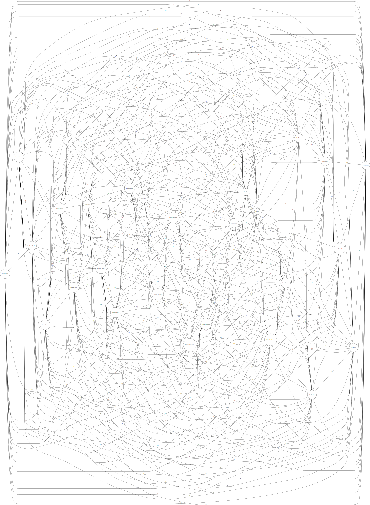


```python
# Listing 24 Generating an undirected graph with PyGraphviz
import graphviz as gv

G = gv.Graph(strict=False)

G.graph_attr['rankdir'] = 'LR'
G.node_attr['shape'] = 'circle'

values = [W[ui][uj] for ui in W for uj in W[ui]]
x_min = min(values)
x_max = max(values)

y_min = 1.0
y_max = 5.0

for ui in W:
    for uj in W[ui]:
        x = W[ui][uj]
        y = y_min + (y_max-y_min) * (float(x-x_min) / float(x_max-x_min))**3
        G.edge(ui, uj, label=str(x), penwidth=str(y))

G
```


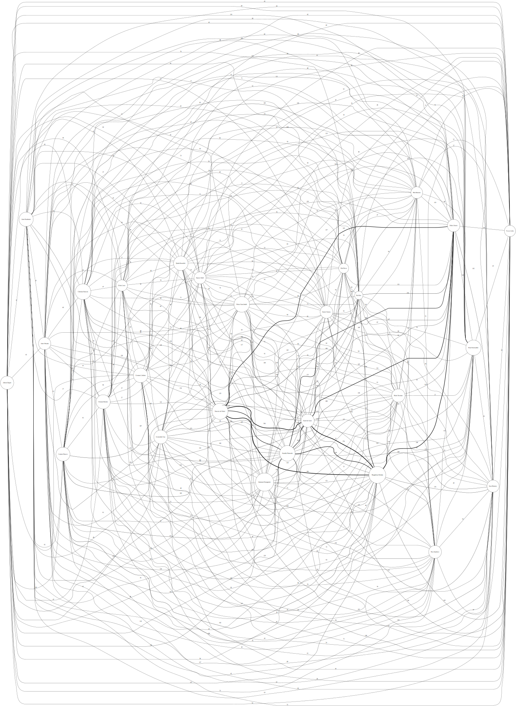


> *Users and activites* measures


```python
# Listing 26 Collecting the set of activities performed by each user
import graphviz as gv

UA = dict()
for caseid in log:
    for i in range(0, len(log[caseid])):
        ai = log[caseid][i][0]
        ui = log[caseid][i][1]
        if ui not in UA:
            UA[ui] = set()
        UA[ui].add(ai)

G = gv.Graph(strict=False)

G.graph_attr['rankdir'] = 'LR'
G.node_attr['shape'] = 'circle'

U = sorted(UA.keys())
for i in range(0, len(U)-1):
    for j in range(i+1, len(U)):
        ui = U[i]
        uj = U[j]
        x = len(UA[ui] & UA[uj])
        if x > 0:
            G.edge(ui, uj, label=str(x))

G
```


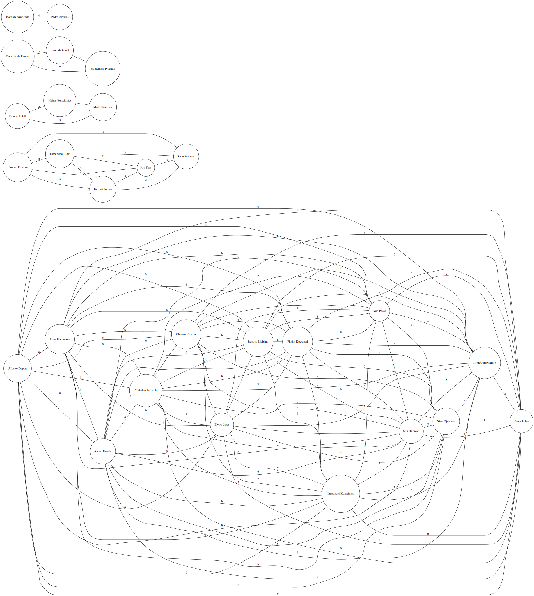


```python
# Listing 28 Counting the number of times that each user performed each task

import graphviz as gv

UA = dict()

for caseid in log:
    for i in range(0, len(log[caseid])):
        ai = log[caseid][i][0]
        ui = log[caseid][i][1]
        if ui not in UA:
            UA[ui] = dict()
        if ai not in UA[ui]:
            UA[ui][ai] = 0
        UA[ui][ai] += 1

G = gv.Graph(strict=False)

G.graph_attr['rankdir'] = 'LR'
G.node_attr['shape'] = 'circle'

values = [UA[ui][ai] for ui in UA for ai in UA[ui]]
x_min = min(values)
x_max = max(values)

y_min = 1.0
y_max = 5.0

for ui in UA:
    for ai in UA[ui]:
        x = UA[ui][ai]
        y = y_min + (y_max-y_min) * float(x-x_min) / float(x_max-x_min)
        G.edge(ui, ai, label=str(x), penwidth=str(y))

G
```


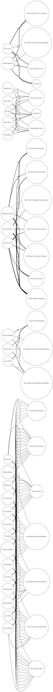


Performance perspective
=======================

Consider to change legend localization by: "loc='upper center', bbox_to_anchor=(0.5, -0.05)" 


```python
# Listing 35 Plotting a dotted chart with Matplotlib

import matplotlib.pyplot as plt

X = dict()
Y = dict()

caseids = sorted(log.keys(),key=lambda caseid: log[caseid][0][-1])

for (y, caseid) in enumerate(caseids):
    for i in range(0, len(log[caseid])):
        (a, _, x) = log[caseid][i]
        if a not in X:
            X[a] = []
            Y[a] = []
        X[a].append(x)
        Y[a].append(y)

for a in sorted(X.keys()):
    plt.plot(X[a], Y[a], 'o', label=a, markersize=20, markeredgewidth=0., alpha=0.5)

axes = plt.gca()

axes.set_yticks(range(len(caseids)))
axes.set_ylim(-1, len(caseids))
axes.set_yticklabels(caseids)
axes.set_ylabel('case id')
axes.invert_yaxis()

axes.set_xlabel('timestamp')
axes.xaxis.tick_top()
axes.xaxis.set_label_position('top')

plt.grid(True)
plt.legend(numpoints=1)
plt.tight_layout()
plt.show()

```


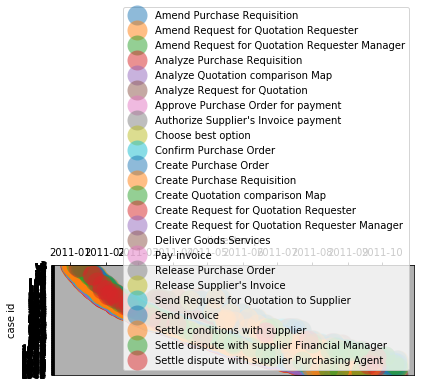


```python
# Listing 36 Plotting a dotted chart with relative time

import matplotlib.pyplot as plt

X = dict()
Y = dict()

caseids = sorted(log.keys(),key=lambda caseid: log[caseid][-1][-1]-log[caseid][0][-1])

for (y, caseid) in enumerate(caseids):
    x0 = log[caseid][0][-1]
    for i in range(0, len(log[caseid])):
        (a, _, x) = log[caseid][i]
        if a not in X:
            X[a] = []
            Y[a] = []
        X[a].append((x-x0).total_seconds()/(24*3600))
        Y[a].append(y)

for a in sorted(X.keys()): 
    plt.plot(X[a], Y[a], 'o', label=a, markersize=20, markeredgewidth=0., alpha=0.5)

axes = plt.gca()

axes.set_yticks(range(len(caseids)))
axes.set_ylim(-1, len(caseids))
axes.set_yticklabels(caseids)
axes.set_ylabel('case id')
axes.invert_yaxis()

axes.set_xlabel('days') 
axes.xaxis.tick_top() 
axes.xaxis.set_label_position('top')

plt.grid(True)
plt.legend(numpoints=1)
plt.tight_layout()
plt.show()


```


```python
# Listing 37 Plotting the histograms of activity execution time

import numpy as np
import matplotlib.pyplot as plt

D = dict()

for caseid in log:
    for i in range(0, len(log[caseid])):
        (a, _, t) = log[caseid][i] 
        if i > 0:
            (_, _, t0) = log[caseid][i-1]
            d = (t-t0).total_seconds()/(24*3600)
        else:
            d = 0. 
        if a not in D:
            D[a] = []
        D[a].append(d)

i = 0
for a in sorted(D.keys()):
    print(sorted(D.keys())[i])
    i += 1
    plt.hist(D[a], bins=[0.1*k for k in range(100)])
    plt.show()
```

    Amend Purchase Requisition


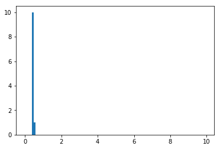


    Amend Request for Quotation Requester


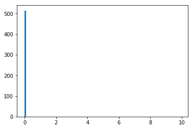


    Amend Request for Quotation Requester Manager


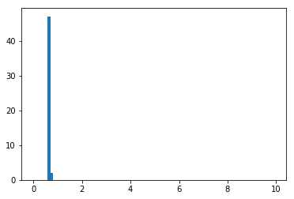


    Analyze Purchase Requisition


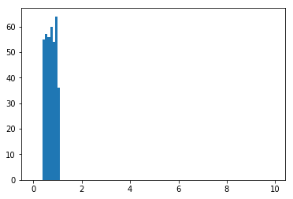


    Analyze Quotation comparison Map


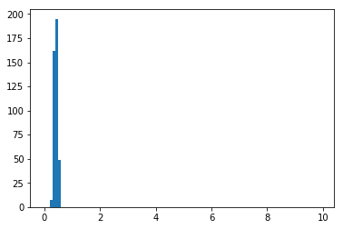


    Analyze Request for Quotation


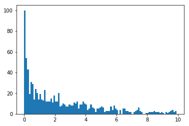


    Approve Purchase Order for payment


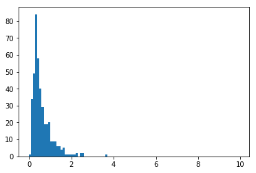


    Authorize Supplier's Invoice payment


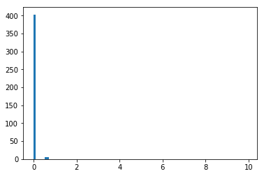


    Choose best option


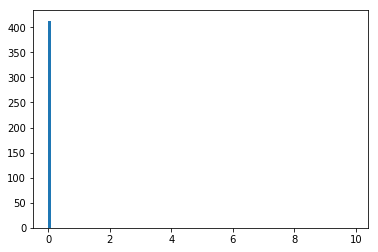


    Confirm Purchase Order


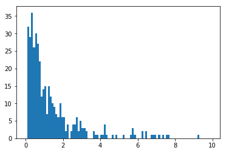


    Create Purchase Order


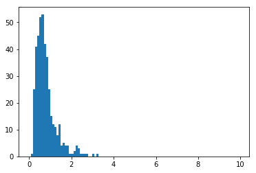


    Create Purchase Requisition


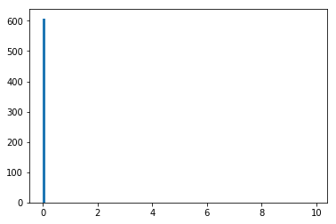


    Create Quotation comparison Map


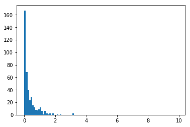


    Create Request for Quotation Requester


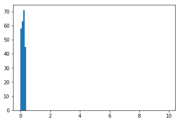


    Create Request for Quotation Requester Manager


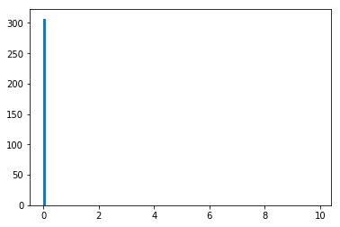


    Deliver Goods Services


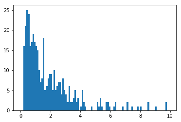


    Pay invoice


    Release Purchase Order


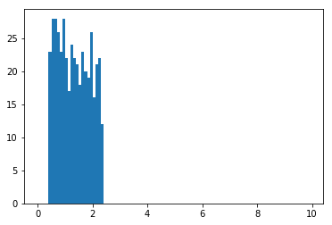


    Release Supplier's Invoice


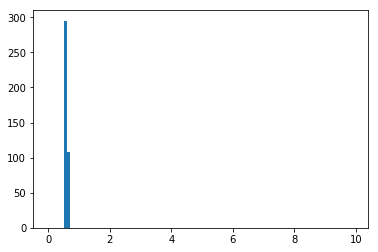


    Send Request for Quotation to Supplier


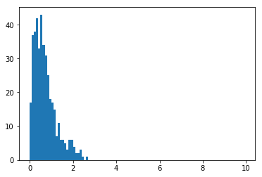


    Send invoice


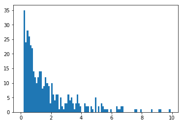


    Settle conditions with supplier


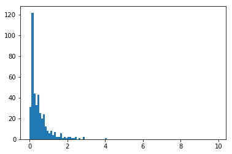


    Settle dispute with supplier Financial Manager


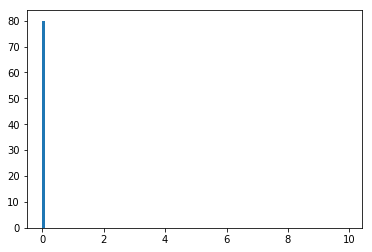


    Settle dispute with supplier Purchasing Agent


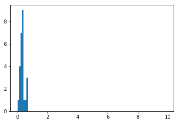

